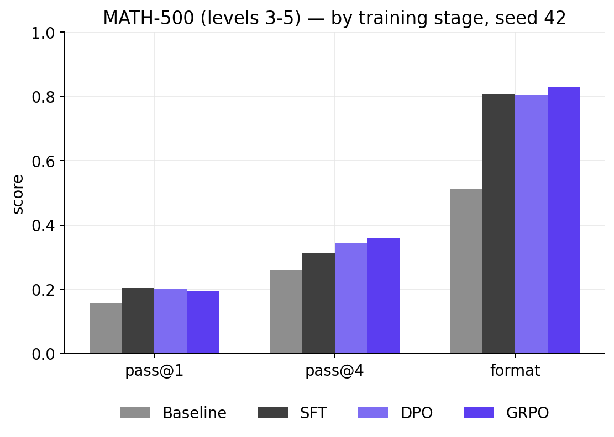
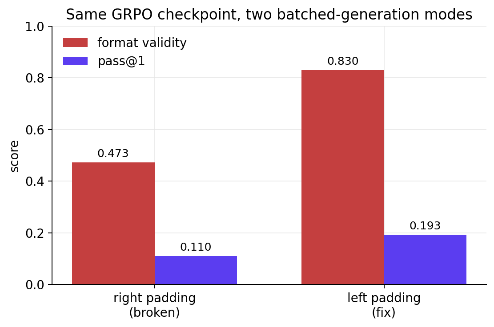

import Callout from '@/components/Callout.astro'
import Pipeline from '@/content/blog/sft-dpo-grpo-single-gpu/components/Pipeline.astro'
import MethodConfig from '@/content/blog/sft-dpo-grpo-single-gpu/components/MethodConfig.astro'
import CompletionDiff from '@/content/blog/sft-dpo-grpo-single-gpu/components/CompletionDiff.astro'
import Citation from '@/components/Citation.astro';

Three DPO runs on a 0.8B model, and the eval was lying the whole time.
The first two runs collapsed pass@1 from 0.20 to 0.10 and format validity from
0.80 to 0.46. I tightened β. I retrained. Same numbers. I went after the data
quality, the LR, the pair filter. Same numbers. Then GRPO, with a structurally
different objective, gave me the same numbers. *Two methods that share almost
nothing internally cannot fail to the same digit by coincidence*, and they
hadn't. The eval was right-padding decoder-only inputs in a batched call,
quietly mangling the prompts of every short example, and the SFT model was the
only checkpoint robust enough to survive the corruption.

This post is three things in one: a three-way post-training ablation on
Qwen3.5-0.8B-Base (SFT baseline, SFT+DPO, SFT+GRPO), the math behind each
method, and the debugging story that got me to the real numbers. Skim if you want the table;
read sections 5 and 6 if you've ever shipped an eval and wished you'd
double-checked the harness.

# 1. Setup

The hardware constraint is the whole story. One AMD 7900 XTX, 24 GB of VRAM,
ROCm 6.4 on Fedora. No second card to merge gradients across, no cluster to
parallelize rollouts on. Every method has to fit there or it doesn't ship.
That rules out full fine-tuning and forces LoRA throughout.

The model is `Qwen/Qwen3.5-0.8B-Base`, the *base* checkpoint, not the
instruct variant. The distinction is sharper than it sounds: on the baseline
eval, the instruct variant of this same model scored *lower* than the raw base
on pass@1 and pass@4 (0.053 vs 0.157, and 0.080 vs 0.260 respectively). General instruction-tuning trades away mathematical
reasoning depth at sub-1B scale. That makes the base model the honest starting
point, and the SFT phase here measures the *full* cost of teaching math format
and reasoning from scratch, not the marginal cost on top of existing tuning.

The eval is MATH-500 levels 3-5, 300 problems sampled from
`EleutherAI/hendrycks_math` (the original `hendrycks/competition_math` was
DMCA-pulled in early 2025). The training set is `AI-MO/NuminaMath-CoT`, split
disjointly: rows 0–8k for SFT, 8k–10k for DPO pairs, 10k+ filtered down to
~420 prompts for GRPO. The eval set is held out from all three. NuminaMath is used rather than the Hendrycks MATH training split: the MATH
train split appears in most 2025 base model corpora, which would contaminate
the comparison.

Everything below is a single-seed run (seed 42). Multi-seed averaging would
strengthen the absolute numbers but doesn't change the per-method story
(flagged as future work in [§7](#7-what-would-move-the-needle-further)). All
code and configs are in the
[repo](https://github.com/tncrd/llm-math-posttraining/tree/main).

<Pipeline />

The full pipeline: NuminaMath as the data source, SFT as the first
post-training stage, DPO and GRPO as alternative second stages launched from
the same SFT checkpoint, and MATH-500 levels 3–5 as the held-out eval that
scores all four checkpoints. Each method gets its own LoRA; none of them
touch the merged weights of the previous stage's adapter.

# 2. Three Objectives

The three methods form a progression: SFT teaches the model *what good output looks like*, DPO teaches it *to prefer correct over incorrect*, GRPO teaches it *to discover correct outputs it couldn't reach before*. Each adds a capability the previous one lacks, and those differences predict exactly which metrics move and which don't. The math here is intuition-first; for derivations, the original DPO and DeepSeekMath papers are linked at the bottom.

## 2.1 SFT: Cross-Entropy on Demonstrations

SFT is the workhorse: maximize the log-likelihood of supervised
chain-of-thought demonstrations. For each training example the model is shown the problem and asked to predict the assistant response one token at a time, left to right. At every position it either assigns high probability to the correct next token (small penalty) or low probability (large penalty). Sum those penalties across the full response, average over all 8,000 demonstrations, and that sum is what training minimises. There is no comparison between responses; every demonstration is treated as equally correct and equally worth imitating. In symbols:

$$
L_{\mathrm{SFT}}(\theta) = -\,\mathbb{E}_{(x,y)\sim D_{\mathrm{demo}}}\!\left[\sum_{t=1}^{|y|} \log \pi_\theta(y_t \mid x, y_{<t})\right].
$$

<Callout title="Term-by-term" variant="explanation" defaultOpen={false}>

- $\theta$: the trainable parameters. Here: the LoRA matrices $A$ and $B$ applied to every linear layer. The base model weights are frozen.
- $D_{\mathrm{demo}}$: the demonstration dataset. Here: 8,000 NuminaMath-CoT examples formatted as `<think>…</think>\boxed{answer}` assistant turns.
- $(x, y)$: a single training example. $x$ is the prompt (user turn ending at `<|im_start|>assistant\n`), $y$ is the full assistant response.
- $y_t$: the $t$-th token of the response. The sum runs only over response tokens; the prompt is masked out with $-100$ in the labels, so it contributes zero loss.
- $\log \pi_\theta(y_t \mid x, y_{<t})$: the log-probability the model assigns to the correct next token given everything before it. Close to 0 when the model is confident and right; large negative when it's unsure or wrong.
- The negative expectation over the dataset: minimising this = maximising the probability of reproducing the NuminaMath demonstrations token by token.
- No notion of "better vs worse" response; every demonstration gets equal weight. That's the ceiling SFT hits.

</Callout>

The model learns *what to imitate*: the `<think>...</think>\boxed{}` format,
the way reasoning steps are laid out, the rough length of a good answer.
Every demonstration gets equal weight; there's no notion of "this CoT is
better than that one." The output of SFT is a checkpoint that *looks*
right; whether it's *correct* often enough is what later stages address.

<MethodConfig method="sft" />

## 2.2 DPO: Bradley-Terry Preference, KL-Anchored

DPO replaces the explicit reward model from RLHF with a closed-form expression
derived from the Bradley-Terry preference model[^1]. The mathematical trick that
makes this possible: the intractable partition function $Z(x)$ cancels exactly
when you take the difference of two log-ratios, leaving a loss you can compute
from the policy and a frozen reference alone, with no reward model in the loop.

For each preference pair, the loss asks one question: has the policy moved
*relatively* more toward the correct response than toward the incorrect one,
compared to where it started? That relative movement is the log-ratio of the
current policy to the frozen SFT reference; positive means the policy now assigns
that response more probability than the reference did, negative means less. The
loss is small when the correct response has a higher relative probability than
the incorrect one, large when it doesn't. In symbols, for pairs $(y_w, y_l)$
where $y_w$ is the correct rollout and $y_l$ is the rejected one:

$$
L_{\mathrm{DPO}}(\theta) = -\,\mathbb{E}_{(x,y_w,y_l)\sim D}\!\left[\log \sigma\!\left(\beta\,\log \tfrac{\pi_\theta(y_w|x)}{\pi_{\mathrm{ref}}(y_w|x)} - \beta\,\log \tfrac{\pi_\theta(y_l|x)}{\pi_{\mathrm{ref}}(y_l|x)}\right)\right].
$$

<Callout title="Term-by-term" variant="explanation" defaultOpen={false}>

- $(x, y_w, y_l)$: a preference triple. $x$ is the prompt, $y_w$ is the chosen (correct) completion, $y_l$ is the rejected (incorrect) one. Generated by sampling 8 rollouts from the SFT model and pairing one correct with one incorrect at random.
- $\pi_\theta$: the policy being trained. Starts as the SFT checkpoint with a fresh rank-8 LoRA on top.
- $\pi_{\mathrm{ref}}$: the frozen SFT checkpoint. Kept in memory alongside $\pi_\theta$; every training step requires two forward passes.
- $\log \tfrac{\pi_\theta(y_w|x)}{\pi_{\mathrm{ref}}(y_w|x)}$: the **implicit reward** for the chosen response: how much more probable the policy makes $y_w$ relative to where it started. Positive = policy moved toward chosen.
- The expression inside $\sigma$ is the **margin**: implicit reward of chosen minus implicit reward of rejected. The loss pushes this margin to be large and positive.
- $\beta = 0.3$: KL penalty strength. Small $\beta$: the policy can drift far from the reference, risking format collapse. Large $\beta$: the policy barely moves. The partition function $Z(x)$ that makes the reward intractable cancels exactly in the difference; that's the mathematical trick that makes DPO work without a reward model.
- $\sigma(\cdot)$: sigmoid. Maps the margin to $(0,1)$; $-\log \sigma$ is large when the margin is negative (wrong ordering), small when it's large positive (correct ordering).
- **Gradient intuition**: the update increases $\log \pi_\theta(y_w|x)$ (like an SFT step on the chosen) and decreases $\log \pi_\theta(y_l|x)$ (the signal SFT never has). The weight $\sigma(-h)$ is close to 1 when the model currently gets the ordering wrong, close to 0 when it already gets it right; self-calibrating hard-example mining.

</Callout>

$\beta$ controls how far the policy can drift from the reference (the SFT
checkpoint here). Small $\beta$ allows aggressive re-ranking but
risks format collapse; large $\beta$ is conservative and may produce no
visible change. Pairs come from sampling 8 rollouts per prompt at $T=0.8$
from the SFT model; rollouts that lack `<think>`, `</think>`, or a parseable
`\boxed{}` are discarded, then one correct and one incorrect are paired at
random; no LLM judge, no human labels. The 2,000-prompt DPO pool yields
707 pairs after filtering.

[^1]: Rafailov et al., *Direct Preference Optimization: Your Language Model is Secretly a Reward Model*, [arXiv:2305.18290](https://arxiv.org/abs/2305.18290).

```python
# DPO training step — two forward passes, no reward model
for x, y_w, y_l in preference_pairs:       # chosen / rejected pair

    # policy forward passes
    logp_w = policy.log_prob(y_w | x)      # log π_θ(y_w | x)
    logp_l = policy.log_prob(y_l | x)      # log π_θ(y_l | x)

    # reference forward passes (frozen, no grad)
    ref_w  = reference.log_prob(y_w | x)   # log π_ref(y_w | x)
    ref_l  = reference.log_prob(y_l | x)   # log π_ref(y_l | x)

    # implicit rewards: how far has the policy moved from the reference?
    reward_w = logp_w - ref_w              # positive → moved toward chosen
    reward_l = logp_l - ref_l

    # margin: chosen implicit reward should exceed rejected
    margin = β * (reward_w - reward_l)
    loss   = -log(sigmoid(margin))         # small when margin > 0, large otherwise
```

<MethodConfig method="dpo" />

<Callout title="DPO pair selection: a reward hacking trap" variant="remark">

The first DPO run used `shortest-correct` as chosen and `longest-incorrect` as
rejected. The intent was quality; the signal DPO received was length. It learned
to output shorter responses in general; pass@1 collapsed to 0.070, worse than
the raw baseline, while mean CoT dropped from 573 tokens to 305.

The mechanism is direct: DPO increases $\pi_\theta(\text{chosen})$ and decreases
$\pi_\theta(\text{rejected})$ relative to the reference. When chosen is
consistently the shortest and rejected consistently the longest, the policy shifts
probability mass toward *short* outputs rather than *correct* ones; length is a
stronger, more consistent feature across pairs than correctness. Training metrics
looked fine (margins grew, pair accuracy rose), but the model had generalized the
wrong property.

The fix is `random.choice(correct)` and `random.choice(incorrect)`, with no length
signal in the selection at all. DPO then has only one consistent difference to
learn from: one response is right, the other is wrong.

</Callout>

## 2.3 GRPO: Group-Relative Advantage, No Critic

GRPO is the algorithm DeepSeekMath introduced[^2] and DeepSeek-R1
popularized[^3]. It's policy-gradient RL with two non-standard tricks: no
value network (which would otherwise need its own training and VRAM), and
advantages estimated entirely from within-group reward statistics.

For each prompt, generate $G=8$ independent completions and score each one. Then ask: was this particular completion better or worse than the average for this prompt? That relative score, the advantage, drives the update. Completions above the group average are made more likely; completions below are made less likely. The size of each nudge is proportional to how far above or below average the rollout scored, normalised by the spread within the group so that high-variance prompts don't dominate. A KL penalty to the SFT checkpoint prevents the policy from drifting into incoherence. For rollout $i$ with reward $r_i$:

$$
A_i = \frac{r_i - \mu_g}{\sigma_g + \varepsilon},\qquad
L_{\mathrm{GRPO}}(\theta) \approx -\,\mathbb{E}\!\left[A_i \log \pi_\theta(y_i \mid x)\right] + \beta_{\mathrm{KL}}\, D_{\mathrm{KL}}(\pi_\theta \,\|\, \pi_{\mathrm{ref}}),
$$

<Callout title="Term-by-term" variant="explanation" defaultOpen={false}>

- $r_i$: the reward for rollout $i$, computed by the reward function in [§3](#3-data-format-and-the-grpo-reward): correctness + format bonuses, length penalty.
- $\mu_g = \frac{1}{G}\sum_j r_j$: the mean reward over all $G = 8$ rollouts for this prompt. This is the **baseline**: it explains how much reward you'd expect from this prompt on average, so the advantage is measured relative to that, not in absolute terms.
- $\sigma_g$: the standard deviation of rewards within the group. If all 8 rollouts get the same reward (all correct or all wrong), $\sigma_g = 0$ and the advantage is undefined; the prompt contributes no gradient. This is why the prompt filter exists.
- $\varepsilon$: a small constant (e.g. 1e-8) to prevent division by zero when $\sigma_g \approx 0$.
- $A_i > 0$: rollout $i$ was above average. The policy is pushed to increase $\log \pi_\theta(y_i \mid x)$, making this reasoning pattern more likely.
- $A_i < 0$: rollout $i$ was below average. The policy is pushed away from it.
- $A_i \log \pi_\theta(y_i \mid x)$: the REINFORCE update weighted by advantage. The negative expectation over the group makes this a minimisation objective.
- $\beta_{\mathrm{KL}}\, D_{\mathrm{KL}}(\pi_\theta \| \pi_{\mathrm{ref}})$: KL penalty to the SFT reference, same role as $\beta$ in DPO: prevents the policy from drifting into incoherent outputs. Computed per-token and averaged over the sequence. In TRL's implementation this is clipped via a PPO-style probability ratio rather than computed exactly.

</Callout>

[^2]: Shao et al., *DeepSeekMath: Pushing the Limits of Mathematical Reasoning in Open Language Models*, [arXiv:2402.03300](https://arxiv.org/abs/2402.03300).
[^3]: DeepSeek-AI, *DeepSeek-R1*, [arXiv:2501.12948](https://arxiv.org/abs/2501.12948).

The interesting failure mode: if all $G$ rollouts succeed (easy prompt) or
all fail (hard prompt), $\sigma_g \to 0$ and the advantage signal vanishes.
This is addressed in [§3](#3-data-format-and-the-grpo-reward): the prompt filter is built precisely to keep
the gradient alive.

```python
# GRPO training step: G rollouts per prompt, no value network
for x in prompt_batch:

    # sample G completions from the current policy
    rollouts = [policy.generate(x, temperature=0.8) for _ in range(G)]  # G = 8

    # score each rollout with the verifiable reward function
    rewards = [reward_fn(x, y) for y in rollouts]  # correctness + format + length penalty

    # group-relative normalisation (critic replacement)
    μ, σ = mean(rewards), std(rewards)

    if σ < ε:                              # all correct or all wrong → no gradient
        continue

    advantages = [(r - μ) / (σ + ε) for r in rewards]

    # policy gradient weighted by advantage + KL stay-close penalty
    pg_loss  = -mean(A * policy.log_prob(y | x) for A, y in zip(advantages, rollouts))
    kl_loss  = β_KL * KL(policy || reference)
    loss     = pg_loss + kl_loss
```

<MethodConfig method="grpo" />

 and v4 (filtered prompts + length penalty).")

# 3. Data, Format, and the GRPO Reward

NuminaMath-CoT provides three pools, each drawn from a different window of the
dataset:

- **SFT**: the first 8000 examples with a parseable `\boxed{}` answer and
  total token length ≤ 2048.
- **DPO**: the next 2000 examples past that cutoff (token length ≤ 1536). Each
  prompt yields up to 8 rollouts from the SFT checkpoint at $T=0.8$; one
  correct and one incorrect are paired to form the preference dataset.
- **GRPO**: examples starting at offset 10000 in the filtered stream, then
  further filtered by difficulty as described below.

The SFT and DPO filters use different sequence-length cutoffs (2048 vs 1536),
so the boundary between them is by position in their respective filtered
streams rather than by a shared row index. Overlap is possible for examples
in the 1537–2048 token range but negligible in practice given the dataset size.

The format invariant matters more than it should. Every training stage
uses the exact same prompt template:

```
<|im_start|>user
Please reason step by step, and put your final answer within \boxed{}.

Problem: {problem}
<|im_end|>
<|im_start|>assistant
```

Every assistant target is wrapped as
`<think>\n{reasoning}\n</think>\n\boxed{answer}<|im_end|>`. SFT bakes this
into the model; the reward function for GRPO scores both format and answer
against the same template. Keeping that string identical across all five
training and eval scripts is not optional; [§6](#6-the-bug-that-nearly-killed-the-result)
is partly a story about what happens when it drifts.

<Callout title="Qwen3.5 template pitfall" variant="remark">

`tokenizer.apply_chat_template(..., add_generation_prompt=True)` inserts a
pre-filled `<think></think>` block into the generation prefix on Qwen3.5.
A post-SFT model trained on a manually-built prompt sees that block already
closed and immediately emits `<|im_end|>`, producing an empty assistant turn
on every example. Building the prompt string manually and using it consistently
across every phase eliminates the ambiguity.

</Callout>

The reward has three components:

**Correctness (+2.0)**: binary match on the extracted `\boxed{}` answer.
Dominates all other terms.

**Format (up to +1.0)**: two independent bonuses that stack. A complete
`<think>…</think>\boxed{}` structure earns +0.5. Each component also earns
partial credit on its own: +0.15 for `<think>`, +0.15 for `</think>`, +0.20
for a parseable `\boxed{}`. A fully formatted response gets both (+0.5 + 0.5);
a clipped response with only some components still earns a non-zero reward,
keeping group reward variance alive early in training when no rollout is fully
correct.

**Length penalty (≤ 0)**: −0.001 per token over the 600-token threshold. Too
small to override a correctness signal, large enough to break ties in favor of
concise reasoning.

Maximum reward: 3.0 (2.0 + 0.5 + 0.5, no length penalty). In symbols:

$$
r(y, y^\star) = 2 \cdot \mathbb{1}[\,\mathrm{boxed}(y) \equiv y^\star\,] \;+\; \underbrace{0.5 \cdot \mathbb{1}[\,\text{full format}\,]}_{\mathrm{format\ full}} \;+\; \underbrace{0.50 \cdot \mathrm{has\_components}(y)}_{\mathrm{partial}} \;-\; 0.001 \cdot \max(0,\, |y| - 600).
$$

<Callout title="Term-by-term" variant="explanation" defaultOpen={false}>

- $\mathbb{1}[\mathrm{boxed}(y) \equiv y^\star]$: binary correctness. The extractor finds the **last** `\boxed{…}` in the response (models often emit intermediate boxed sub-results mid-reasoning), normalises the expression (fractions to floats, mixed numbers, scientific notation), and checks numeric equality within tolerance 1e-6. Correct = **+2.0**.
- $\mathbb{1}[\text{full format}]$: 1 if the response contains `<think>`, `</think>`, and a parseable `\boxed{…}`, all three. The complete expected structure. **+0.5**.
- $\mathrm{has\_components}(y)$: partial credit, scored independently: +0.15 for `<think>`, +0.15 for `</think>`, +0.20 for a parseable `\boxed{}`. Maximum 0.50 when all three are present. Stacks with the full-format bonus; a fully correct, fully formatted response earns 2.0 + 0.5 + 0.5 = **3.0** total (before length penalty).
- Why partial credit? Without it, a clipped completion that has `<think>` but no closing tag gets reward 0, same as a completely incoherent output. The gradient signal collapses early in training when the model rarely produces a full correct response. Partial credit keeps reward variance non-zero across the group even when no rollout is fully correct.
- $0.001 \cdot \max(0,\, |y| - 600)$: soft length penalty. At 1000 tokens: −0.4, which cannot override a correctness signal (+2.0) but breaks ties between equally-correct rollouts in favour of the shorter one. $|y|$ is the token count of the completion, measured by the same tokenizer used for training.

</Callout>

Correctness dominates at +2.0; everything else is secondary. Format
contributes up to +1.0 across two stacking bonuses: +0.5 for a complete
`<think>…</think>\boxed{}` structure, plus partial credit per component
(+0.15 for `<think>`, +0.15 for `</think>`, +0.20 for a parseable `\boxed{}`)
that keeps the gradient alive when a clipped completion has some structure
but not all. The length penalty acts as a tie-breaker: between two
equally-correct rollouts, the shorter one wins by 0.001 per token over 600.
One non-obvious detail: the extractor takes the *last* `\boxed{}` in the
response, not the first; models often emit intermediate boxed sub-results
mid-reasoning, and the final answer is always at the end.

<Callout title="The prompt filter: the single highest-leverage GRPO change" variant="remark">

GRPO's gradient depends on within-group reward variance. If all 8 rollouts
of a prompt succeed, $\sigma_g = 0$ and the prompt contributes nothing.
Same if all 8 fail.

For each of 1000 candidate prompts, 8 rollouts were sampled from the SFT
checkpoint and kept only if $1 \le k \le 7$ were correct. **Retention: 420
prompts (42%).** The pass-rate distribution of the kept set was
min=0.12, mean=0.35, max=0.88, exactly the high-signal regime where the
group statistics carry actual information.

This is the difference between v3 and v4 in the training-curve figure
above.

</Callout>

A side-by-side on a level-3 problem the eval set has, after each post-training
stage:

<CompletionDiff problem="a" />

Read column-by-column: SFT extends the response, structures it, and gets the
answer correctly. DPO is similarly correct but slightly more concise. GRPO
is the most compact while still wrapping the reasoning correctly; the
length penalty plus the format reward together push it in that direction.
The base model (not shown; the baseline eval pre-dates the per-example
output saving) emits no `<think>` tags and a short direct answer; that
stylistic gap is what SFT closes.

# 4. Results

Single seed (42), 300 MATH-500 examples (levels 3–5), pass@1 with greedy
decoding, pass@4 with $T=0.7$ sampling (at least one of 4 samples correct).

| Stage                               | pass@1 | pass@4 | format | mean CoT |
| ----------------------------------- | ------ | ------ | ------ | -------- |
| Baseline (Qwen3.5-0.8B-Base)        | 0.157  | 0.260  | 0.513  | 401      |
| SFT                                 | 0.203  | 0.313  | 0.807  | 586      |
| DPO (β=0.3)                         | 0.200  | 0.343  | 0.803  | 571      |
| GRPO (filtered + length pen)        | 0.193  | **0.360** | **0.830** | 545      |



**SFT** does the heavy lifting on greedy accuracy: +0.046 pass@1 over
baseline, format validity nearly doubles (0.51 → 0.81), and mean
chain-of-thought stretches from 401 to 586 tokens. None of this is
surprising; SFT is the stage where the model learns the format.

**DPO** holds pass@1 essentially steady (-0.003 vs SFT) and adds +0.030
on pass@4. Preference learning earns its keep on sampling diversity:
the same model, run 4 times at $T=0.7$, hits a correct answer more often
in aggregate even though its single best greedy output is unchanged. This
is consistent with what DPO actually does; it broadens the policy toward
preferred completions in the chosen-vs-rejected sense, not necessarily
toward the single most-likely token at each step.

**GRPO** has the highest format validity (0.830) and the highest pass@4
of any stage (0.360, +0.047 vs SFT, the largest delta in the table).
Pass@1 dips slightly (-0.020 vs SFT). This is *also* consistent with what
GRPO does: it directly optimizes the stochastic sampling distribution at
$T=0.8$, not the greedy mode, and at this scale the two distributions don't
move together. This is the subject of [§5](#5-why-pass1-was-the-wrong-headline-metric).

.")

The CoT-length violins capture an underrated aspect of these methods: each
stage *moves the distribution*, not just its mean. SFT goes from a tight
cluster to a long-tailed distribution, GRPO contracts the long tail thanks
to the length penalty, and DPO sits between them. None of the three is
"making the model answer longer" or "making it answer shorter" globally;
they are reshaping where the mass lives.

# 5. Why pass@1 Was the Wrong Headline Metric

Anyone with a few large-model RL runs in their muscle memory will look at
the table in [§4](#4-results) and say "GRPO didn't beat SFT on pass@1, that's a failure."
This is the wrong frame at this scale, and the reason is structural.

GRPO trains by sampling $G=8$ completions per prompt at $T=0.8$ and
rewarding the better ones within each group. **It directly optimizes the
stochastic sampling distribution.** Pass@1 is greedy decoding (argmax at
every step), a different mode of the same distribution. At small scale
and short training horizons, the two modes don't have to move together:
the sampling distribution can sharpen toward correct answers while the
greedy mode stays roughly where SFT left it.

That's exactly what the v4 numbers show. Pass@4, which samples 4
completions at $T=0.7$ and counts any-correct, jumped from SFT's 0.313 to
0.360, a +15% relative gain, the largest pass@4 improvement of any
post-SFT method in the ablation. Pass@1 stayed flat at 0.193, ~1 point below SFT. The GRPO
improvement is real and measurable; it just lives in pass@k, not pass@1.

<Callout title="Reward design: why partial credit matters" variant="note">

The first GRPO run I shipped had a binary reward: +1.0 if correct
(boxed match), 0 otherwise (with a small format bonus). It produced
training metrics that looked dead in the water; `reward_std` close to
zero on most groups, and the policy never moved.

The fix wasn't the optimizer or the LR; it was the reward shape. With
partial credit (0.15 for `<think>`, 0.15 for `</think>`, 0.20 for a
parseable `\boxed{}`, +0.5 for the full structure) and a soft length
penalty, every group has graded outcomes even when no one rollout is
fully correct. Reward variance comes back, the gradient comes back, and
the policy starts moving.

The lesson generalizes: at small scale, dense rewards are not optional.
A binary reward needs *more* steps and *more* prompts than the budget
allows.

</Callout>

The pass@k argument predicts which problems GRPO would help on: medium
problems where the SFT model is on the boundary of competence and the
right answer is reachable from one of the 4–8 samples but not from the
single greedy output. Here's such a problem (level 4):

<CompletionDiff problem="b" />

SFT and DPO both fail to even produce a boxed answer; they wander into
the reasoning and get lost. GRPO gets it cleanly. Greedy on GRPO doesn't
always solve this kind of problem at random, but with 4 samples, it's
almost always there, which is the +0.047 pass@4 gain in the table.

# 6. The Bug That Nearly Killed The Result

The numbers in [§4](#4-results) are the *second* set of numbers I got. The first set,
which I held for two days, said:

| Stage              | pass@1 | format |
| ------------------ | ------ | ------ |
| SFT                | 0.203  | 0.807  |
| DPO (early)        | 0.097  | 0.457  |
| DPO (β=0.3 retry)  | 0.107  | 0.463  |
| GRPO (early)       | 0.090  | 0.453  |
| GRPO (length pen)  | 0.110  | 0.473  |

Four post-training runs collapsing to ~0.10 pass@1 and ~0.46 format
validity, regardless of method, regardless of hyperparameters. A "DPO is
a negative result on small-data math" conclusion was forming. Nearly
shipped it.

What unlocked the diagnosis was looking at the GRPO checkpoint outputs
themselves. The `outputs.json` artifact saved by the eval harness showed
something strange: out of 300 evaluated examples, only 39 contained a
`<think>` opening tag, but 143 contained a `</think>` closing tag. The
model was emitting closing tags with no opens, generating as if it were
already inside a thinking block. **Something was injecting context the
model wasn't supposed to see.**

The diagnostic is one script. Generate the same 3 prompts two ways: once
batched with right-padding (eval harness style), once one prompt at a
time. If the model outputs differ, the batching is the culprit.

```python
# scripts/diag_grpo.py: short version

prompts = [build_prompt(p) for p in problems]

# Eval harness path: batched, right-padded
tokenizer.padding_side = "right"
ids_r = tokenizer(prompts, return_tensors="pt", padding=True).to(model.device)
out_r = model.generate(**ids_r, max_new_tokens=300, do_sample=False)

# Reference path: same prompts, single batch with left-padding
tokenizer.padding_side = "left"
ids_l = tokenizer(prompts, return_tensors="pt", padding=True).to(model.device)
out_l = model.generate(**ids_l, max_new_tokens=300, do_sample=False)
```

The output speaks for itself:

```
=== padding_side=right ===
P0 (short)  open=False close=True  box=True   → " and 3 are both natural numbers..."
P1 (medium) open=True  close=True  box=True   → "<think>\nTo solve for 2x + 1..."
P2 (long)   open=False close=False box=False  → "and 10.\n<|im_end|><|endoftext|>..."

=== padding_side=left ===
P0 open=True close=True box=True → "<think>\nTo solve the problem..."
P1 open=True close=True box=True → "<think>\nTo solve for 2x + 1..."
P2 open=True close=True box=True → "<think>\nTo compute the sum..."
```

With right-padding, two of three prompts have garbled output. The shortest
prompt loses its `<think>` open and starts mid-content; the longest, when
not the longest in its batch, gets EOT spam. With left-padding, all three
are clean.



**Why decoder-only models break under right-padding**: the model attends
left-to-right; generation continues from the last token of `input_ids`.
Right-padding puts pad tokens *after* the actual prompt content, so the
generation continuation point is no longer where the assistant turn marker
ended; it's separated by N pad tokens, where N varies per prompt in the
batch. The attention mask ostensibly fixes this, but on Qwen3.5 (and
several other modern decoder-only families) the position-id bookkeeping
is fragile under right-padding and short prompts get systematically
corrupted. The transformers library's own warning, *"decoder-only
architecture but right-padding detected"*, is logged on every batch, and
ignored, because SFT eval still produced sensible numbers.

The fix is one line in `src/math_pt/eval/harness.py`:

```python
tokenizer.padding_side = "left"
inputs = tokenizer(prompts, return_tensors="pt", padding=True, truncation=True).to(model.device)
```

After applying it and re-running the three evals, all four post-training
runs jumped: DPO from 0.107 to 0.200 pass@1, GRPO from 0.110 to 0.183.
SFT was unchanged at 0.203; its broader policy was already robust to the
corruption, which is precisely why the bug had been invisible for two days.
The remaining gap between GRPO's 0.183 here and the 0.193 in [§4](#4-results)'s table
is the prompt filter and length penalty from [§3](#3-data-format-and-the-grpo-reward), applied after the eval
fix was confirmed.

<Callout title="Cost of the bug" variant="remark">

Five retraining cycles (3 GRPO + 2 DPO), about 10 GPU-hours, and three
days of debugging. The fix was one line. The under-recognized lesson:
*if multiple structurally different methods (preference learning, outcome
reward) collapse to the same numbers from the same SFT base, the eval is
suspect before the methods are.*

There was a second, smaller bug riding alongside this one: a stale
`_SFT_PASS1 = 0.170` constant in `run_dpo_eval.py` and `run_grpo_eval.py`.
The 0.170 came from an early SFT run before a data-formatting fix: the original
training text placed `\boxed{answer}` *inside* the `<think>` block (using the raw
NuminaMath solution field verbatim), training the model to emit answers in the wrong
position. After rebuilding training text as `<think>\n{reasoning}\n</think>\n\boxed{answer}`,
SFT pass@1 jumped to 0.203. The hardcoded constant was never updated. Even without
the padding bug, the printed "delta vs SFT" had been overstating the gap by 0.033
on every comparison.

</Callout>

# 7. What Would Move the Needle Further

The deltas in [§4](#4-results) are real but modest. With another week and another budget,
the levers are clear:

- **vLLM rollouts.** TRL's GRPO implementation supports `use_vllm=True`,
  which can speed up generation 3–5×. ROCm vLLM on the 7900 XTX wasn't
  validated at the time of writing; it would let the same wallclock fit
  ~1000 GRPO steps instead of 300.
- **Group size 16 instead of 8.** Reduces advantage variance per step,
  which helps especially for prompts near the boundary of the SFT model's
  competence. Costs about 2× rollout VRAM, manageable with gradient
  checkpointing.
- **Multi-seed.** Single-seed RL on a small model is noisy. Three seeds
  (42, 1337, 2024) and reporting mean ± std would catch any
  pseudo-improvement that's actually within run-to-run variance.
- **A stronger SFT base.** With higher SFT pass@1, the prompt filter
  retains harder problems, the GRPO signal is denser, and the
  pass@1-vs-pass@k gap may close.
- **Rejection-sampling SFT after GRPO.** Once GRPO has improved the model,
  generate many rollouts per problem and keep only the correct ones. Fine-tune
  on that curated set; standard SFT, but on the model's *own* correct
  reasoning chains rather than the original NuminaMath demonstrations. This
  consolidates the GRPO gains into the weights more stably and gives the model
  a self-consistent set of reasoning chains to learn from. This is the step that
  closes the SFT → GRPO → RS-SFT loop at the core of the DeepSeek-R1[^3]
  pipeline. At 0.8B with 300 GRPO steps the capability gain may not yet be
  large enough to make this worthwhile, but it becomes the highest-leverage
  next step once GRPO training is extended.

None of these are method changes; they're capacity changes. The methods
themselves did what they should at the scale they were given.

# 8. What This Run Actually Showed

Three concrete things from this run:

**At small scale, pass@k is the GRPO signal, not pass@1.** Reporting only
greedy accuracy hid a +15% relative pass@4 gain that turned out to be the
strongest individual method effect in the whole ablation. If you're
comparing post-training methods on a sub-1B model, lead with pass@k and
treat pass@1 as a secondary metric.

**Eval pipelines are not free.** The transformers warning *"decoder-only
architecture but right-padding detected"* is logged on every batched
generation. Treating it as benign cost three days here. If multiple
structurally different methods produce identical outputs on the same eval,
the eval should be the prime suspect before the methods.

**Per-method roles are real and distinct.** SFT teaches form
(format, CoT length, structure). DPO broadens the high-likelihood region
toward preferred completions, which shows up as pass@k gains, not pass@1.
GRPO sharpens the sampling distribution against a verifiable reward, which
shows up as both pass@k gains and the highest format validity.
None of the three dominates pass@1, and that's a finding too.

The repo for everything in this post (code, configs, generated plots) is at [github.com/tncrd/llm-math-posttraining](https://github.com/tncrd/llm-math-posttraining/tree/main).
The eval harness is `src/math_pt/eval/harness.py`. Check
`tokenizer.padding_side` before you run.

# Citation

<Citation
  type="informal"
  author="Hyr, Tncr"
  title="SFT vs DPO vs GRPO on a Single GPU: What Actually Moves the Needle on a 0.8B Model"
  journal="tncrd.github.io"
  date="Apr 2026"
/>

<Citation
  type="bibtex"
  id="hyr2026posttrainingablation"
  title="SFT vs DPO vs GRPO on a Single GPU: What Actually Moves the Needle on a 0.8B Model"
  author="Hyr, Tncr"
  journal="tncrd.github.io"
  year="2026"
  month="Apr"
/>
