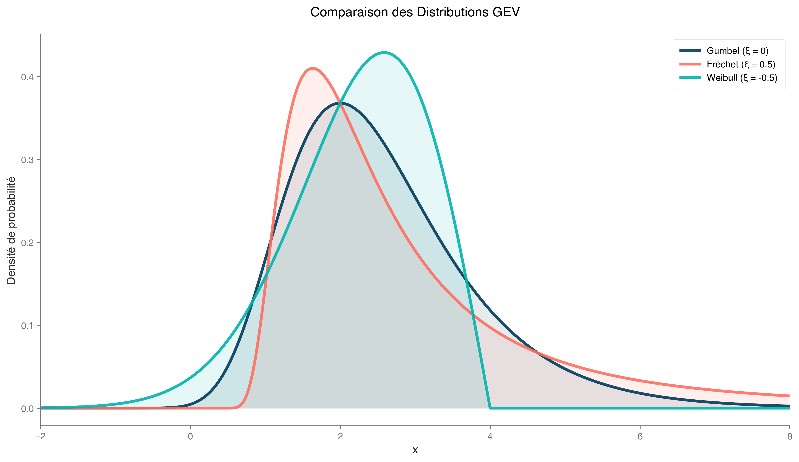
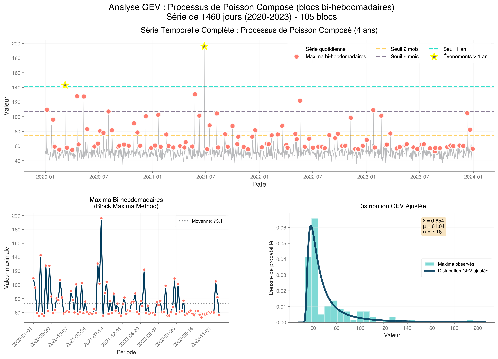
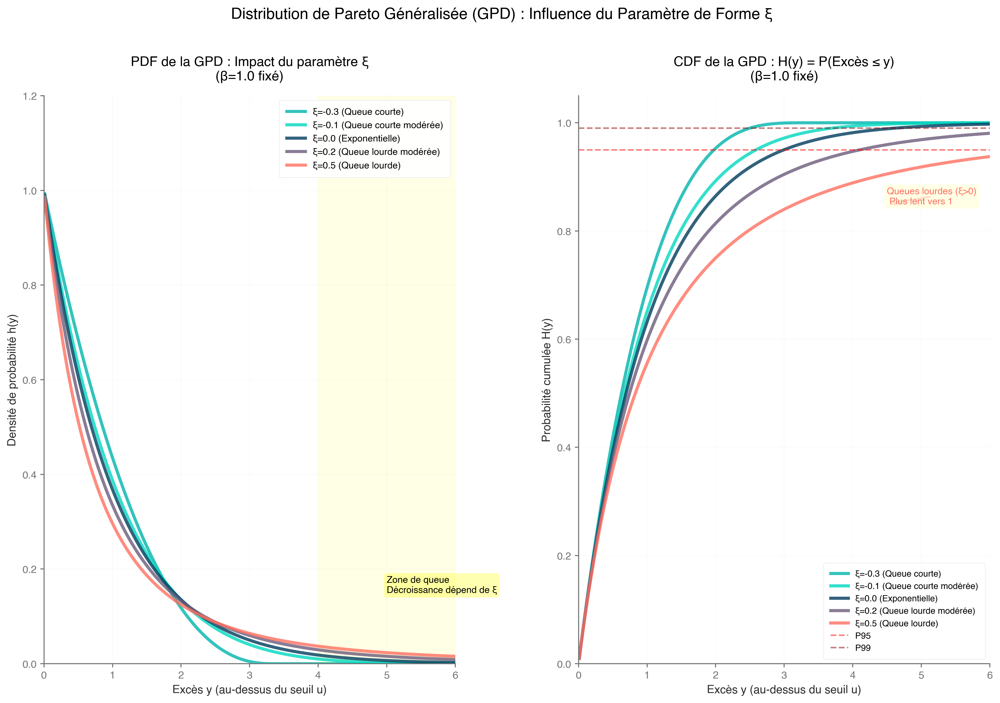
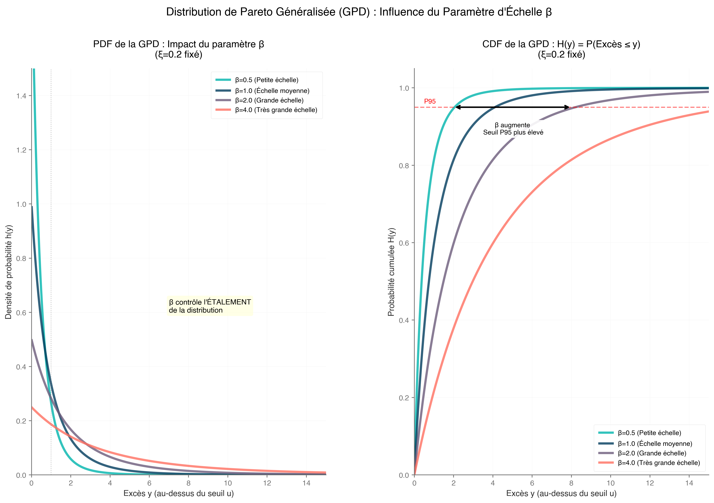
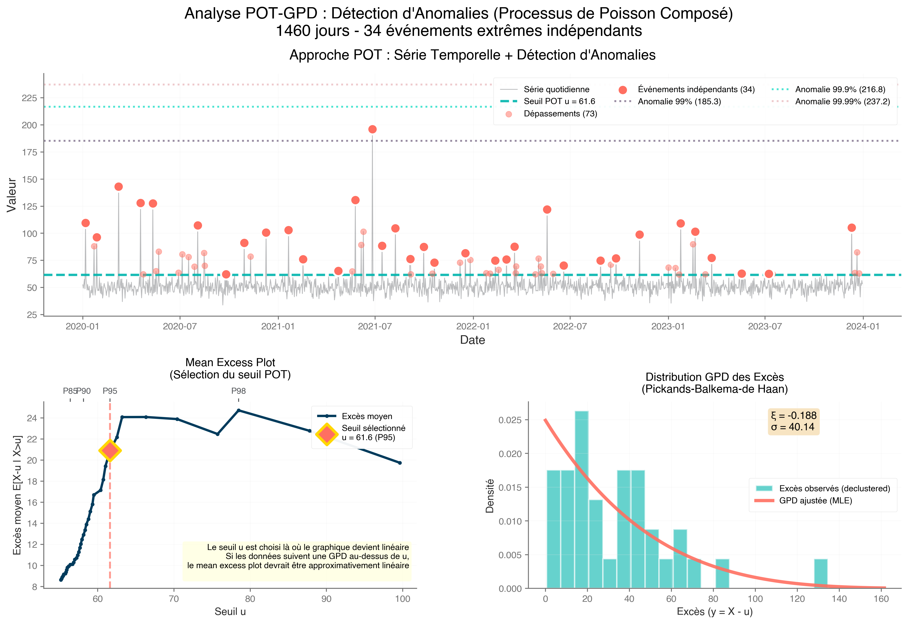
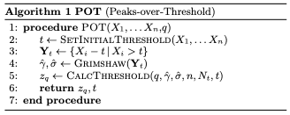
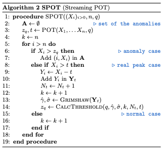
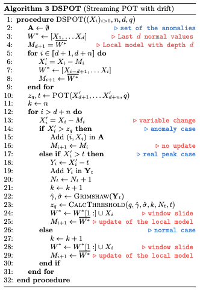

import Callout from '@/components/Callout.astro'
import { Icon } from 'astro-icon/components'
import Citation from '@/components/Citation.astro';

When applying the Peak Over Threshold (POT) method to time series anomaly detection, it's essential to ground it in Extreme Value Theory (EVT). EVT provides the mathematical foundation for modeling rare, extreme events—like anomalies in time series data—by focusing on the tails of distributions rather than their central tendencies. Drawing from core concepts in EVT, including the Generalized Extreme Value (GEV) distribution, Generalized Pareto Distribution (GPD), and relevant theorems. This will help readers build the intuition needed to appreciate how an elegant method can identifies anomalies by thresholding extreme values in time series.

I've synthesized the most relevant points for POT understanding, focusing on theorems, distributions, and their ties to anomaly detection in time series.

# 1. Introduction to EVT and Its Relevance to Anomalies

Extreme Value Theory (EVT) is the statistical framework for analyzing the extremes (maxima or minima) of data distributions, analogous to how the Central Limit Theorem handles sums or averages. 

> **The Parallel Structure in question (there is some terminology spoil don’t worry)**:
> 
> - **CLT** focuses on *bulk* behavior: 
> For i.i.d. random variables $X_1,…,X_n$ with finite variance, the *sum* $S_n=X_1+⋯+X_n$ (or average $\bar{X}_n = S_n/n$) converges *in distribution* to a normal after centering/scaling:
> $\frac{S_n - n\mu}{\sqrt{n}\sigma} \xrightarrow{d} \mathcal{N}(0,1)$ (or equivalently for the average). 
> This holds for *most* distributions $F$ (as long as tails aren't too heavy), explaining why averages "look Gaussian" for large $n$.
> - **EVT** focuses on *tail* behavior: For the same i.i.d. $X_i$, the *maximum* $M_n = \max(X_1, \dots, X_n)$ converges to a GEV distribution after normalization:
> $\frac{M_n - b_n}{a_n} \xrightarrow{d} G(x; \mu, \sigma, \xi)$. 
> 
> This depends only on the *right-tail* heaviness of F (left-tail for minima), yielding just 3 families (Gumbel/Fréchet/Weibull) regardless of the bulk of F.
> 
> **Why "Analogous"?**
> 
> - Both are *limit theorems* for functionals of i.i.d. samples: CLT for additive ops (sums → "typical" values); EVT for extremal ops (max → "rare" values).
> - Both enable universal approximations: CLT gives Gaussian for centers; EVT gives GEV for tails—predicting extremes like 100-year floods from limited data.
> - Derivation Insight: CLT via characteristic functions or Lindeberg conditions (cf. wikipedia) ; EVT via *point process* limits on exceedances or direct tail equivalence.
> 
> With this two in mind you can model all levels of events: averages for everyday, maxima for disasters.
> 

In time series anomaly detection, anomalies often manifest as extreme deviations—e.g., sudden spikes in a series. 

While traditional methods like z-scores focus on means and variances, EVT targets the tails[^1], where anomalies live. For POT, EVT ensures we can model these tails reliably to set thresholds that flag rare events without excessive false positives.

[^1]: Key insight: As sample size grows, the distribution of normalized maxima converges to one of three forms (that we will explore but not in detail, if you need more refer to books about EVT like *An introduction to statistical modeling of extreme values - Stuart Coles*), enabling extrapolation beyond observed data—crucial for predicting unseen anomalies.

# 2. Generalized Extreme Value (GEV) Distribution and Block Maxima Approach: The Starting Point

The block method is EVT's traditional entry point (or it was mine). 

Divide your time series into non-overlapping blocks (e.g., daily, monthly or yearly windows), extract the maximum (minimum) values from each and model them. This will create a series that we can analyse partially using the **Fisher-Tippett-Gnedenko Theorem.**

So, what is it **?**

Proven in the early 20th century, by Fisher et Tippett in 1928 and generalise by Gnedenko in 1943 (hence the name), it help us understand the organization of extreme value distributions under specific conditions.

By taking a sequence of independent and identically distributed random variables (i.i.d), this states that if a normalized maximum $M_n = \max(\xi_1, \dots, \xi_n)$ , it does so to a Generalized Extreme Value (GEV) distribution say for a pair of real number ($a_n,b_n$) exist in sort of : 
$$\lim\limits_{n\rightarrow+\inf}P\left( \frac{M_n - b_n}{a_n} \leq x \right) \to G_\gamma(x),$$

where $a_n > 0$ and $b_n$ are normalizing constants. 
$G_{\xi}(x)$ represents one of the three non-degenerate (what a lovely term) distributions.

Not all distributions converge, but most practical ones do, falling into GEV "domains of attraction", known as generalized extreme value distributions: Gumbel, Fréchet or Weibull (these three guys will be present along the post, be sure to memorize it!).

We can formulate the limiting distributions of block maxima as :

$$G_\gamma(x) = \exp\left( -(1 + \gamma x)^{-1/\gamma} \right)$$

for $1 + \gamma . x > 0$, with shape $\gamma$ as location and scale parameters.

Based on different $\gamma$ scale value, we can identify our three types:

- $\gamma > 0$ : Fréchet (heavy tails, unbounded; e.g., Pareto-like financial crashes).
- $\gamma = 0$ : Gumbel (light tails; e.g., exponential or normal distributions for sensor noise).
- $\gamma < 0$ : Weibull (bounded tails; e.g., uniform for capped metrics).



Représentation des distribution de Fréchet, Gumbel et Weibull pour un $\gamma$ fixé.

For anomalies, heavy tails ($\gamma > 0$) indicate potential for extreme outliers, guiding threshold selection in POT.

To be more clear, it states that the normalized maxima of a sequence of independent and identically distributed (i.i.d.) random variables, if they converge, and they often are, follow one of three GEV types.[^2]

<Callout title="Limitation for Time Series" variant="remark">
In anomaly detection, blocks might miss multiple extremes in one period or waste data in quiet periods. This inefficiency leads to POT as a refinement.

(Example: In sensor data, block maxima might capture monthly peak temperatures, but POT can catch all heatwaves exceeding a threshold.)
</Callout>



[^2]: In time series, we can estimate GEV parameter via maximum likelihood like we did in the figure above. 

# 3. Shifting to Thresholds: Exceedances and Residuals

The block maxima approach captures the largest value in fixed time periods, but it can miss multiple extreme events or waste data in quiet periods. The Peak Over Threshold (POT) method overcomes this by focusing on **threshold exceedances**—data points in a time series that surpass a high threshold $u$. 

This shift is critical for anomaly detection, as anomalies (e.g., sudden spikes in server load or stock price drops) often appear as extreme values in the tail of a distribution. 

This section explores the mechanics of exceedances, their statistical properties, and practical considerations for applying them in time series anomaly detection.

Threshold exceedances are values in a dataset (or time series) $\xi_t$ that exceed a chosen high threshold $u$, i.e., $\xi_t > u$. 
Unlike block maxima, which select only one extreme per block (e.g., the highest temperature each month), the POT approach considers *all* values above $u$, regardless of when they occur. This makes it more efficient for time series, where anomalies may cluster (e.g., multiple network attacks in a day) or be sparse (e.g., rare equipment failures).

For example, in a time series of daily website traffic, setting $u$ at the 95th percentile flags unusually high traffic days as potential anomalies (e.g., due to viral content or DDoS attacks). The key is that exceedances focus on the tail, where EVT excels, rather than the bulk of the data, which standard statistical methods handle.

Once focus on exceedances, we compute the **excesses**: the amounts by which values exceed the threshold, defined as $y = \xi_t - u$ for $\xi_t > u$.

These excesses are the focus of POT because their distribution approximates the Generalized Pareto Distribution (GPD, discussed in Section 5), as justified by the Pickands-Balkema-de Haan theorem (discussed in Section 6). 

In statistical terms, excesses represent the "residual lifetime" of a process surviving past $u$, a concept borrowed from survival analysis.

In survival analysis, the residual lifetime is the additional time a subject survives after reaching a certain point. Similarly, in EVT, the excess $y$ represents how far an extreme value extends beyond $u$.[^3]

But selecting an appropriate threshold $u$ is not a trivial question needing to balance two goals:

- **Sufficient data**: $u$ must be low enough to capture enough exceedances for reliable GPD parameter estimation.
- **Tail focus**: $u$ must be high enough to ensure following a GPD.

**Practical Tools for Threshold Selection**:

- **Mean Excess Plot**: Plot the mean of excesses $E(\xi_t - u | \xi_t > u)$ against $u$. A linear region indicates where GPD assumptions hold.
- **Quantile-Based Rules**: Sets $u$ at a high quantile (e.g., 90th or 95th percentile), adjusted based on domain knowledge.
- **Parameter Stability**: Fit GPD to excesses for various u and choose a range where shape ($\xi$) and scale ($\beta$) estimates are stable. Instability at low $u$ indicates contamination from non-extreme data.

[^3]: For more real deep explanation I invite you to read the chapter 4 of **An Introduction to statistical Modeling of Extreme Values by Stuart Coles** or [also this paper](https://www.ine.pt/revstat/pdf/rs120102.pdf)[^4]

[^4]: The Time Series case is challenging. Unlike i.i.d. data, time series often exhibit trends, seasonality, or volatility clustering. For example, network traffic might spike daily during peak hours, inflating exceedances. Adjust $u$ dynamically (e.g., using a rolling quantile) or preprocess the data to remove trends, for example.

# 4. Generalized Pareto Distribution (GPD)

There's a lot of talk about GPD, but what exactly is it?
 
We’ve been discussing excesses, and the GPD is the formula that helps us models and represent them :

$$H_{\xi, \beta}(y) = 1 - \left(1 + \frac{\xi y}{\beta}\right)^{-1/\xi}$$ 

where; 

- $y > 0$ is the excess over threshold $u$
- $1 + \frac{\xi*y}{\beta} > 0$, ensuring the distribution is well-define.
- $\beta$, the scale parameter.
- $\xi$, the shape parameter (could be equivalent to the $\gamma$ GEV distribution parameter’s)

<Callout title="Special case" variant="corollary">

For $\xi = 0$,  the GPD simplifies to an exponential distribution $1 - e^{-y/\beta}$:

$$H_{0, \beta}(y) = 1 - e^{-y/\beta}$$
</Callout>

Parameter $\xi$ impact on GPD.


Parameter $\beta$ impact on GPD.


This case applies to light-tailed distributions, such as those arising from normal or exponential data, common in sensor noise or stable processes.

The GPD is particularly valuable because it allows us to estimate extreme quantiles and set anomaly detection thresholds with statistical rigor. In time series, fit GPD to declustered excesses to handle dependencies.

To resume, GPD approximates tails for large $u$, allowing estimation of extreme quantiles (e.g., 99.9th percentile for anomaly thresholds).

This next section will explore why this approach works. I aim to convince you that these concepts are not arbitrary and that they provide an elegant solution to your thresholding problems.

# 5. The second EVT most important concept, the Pickands-Balkema-de Haan Theorem

The Pickands-Balkema-de Haan Theorem is a fundamental result in EVT that connects the behavior of extreme values to the **Generalized Pareto Distribution (GPD)**. Specifically, it states that for a distribution within the domain of attraction of a **Generalized Extreme Value (GEV)** distribution (i.e., its normalized maxima converge to a Gumbel, Fréchet, or Weibull distribution), the conditional distribution of *excesses* over a sufficiently high threshold ( u ) converges to a GPD. 

Mathematically:

$$P(\xi_t - u \leq y \mid \xi_t > u) \approx H_{\xi, \beta}(y),$$

where, ( $\xi_t$ ) is the time series value, ( $y = \xi_t - u$ ) represents the excess over threshold ( $u$ ), and ( $H_{\xi, \beta}(y)$ ) is the GPD with **shape parameter** ( $\xi$ ) and **scale parameter** ( $\beta$ ) ; I know it's repetitive, but knowledge is built on repetition, isn't it?

The GPD is defined as: look above.

A key insight is that the GPD’s shape parameter ( $\xi$ ) aligns with the GEV’s shape parameter ( $\gamma$ ), ensuring consistency between the block maxima approach (reminder, fitting GEV to maximum values over time blocks) and the POT approach (reminder, modeling excesses over a threshold).

This connection makes the theorem a powerful tool for analyzing extreme events without needing to model the entire distribution.

## Bonus : Theoretical Foundations - Domains of Attraction, Von Mises Conditions and Proof Insight

The Pickands-Balkema-de Haan theorem, a cornerstone of Extreme Value Theory, builds on the Fisher-Tippett-Gnedenko theorem. 

As a reminder, this last one, establishes that the maxima of a normalized dataset converge to one of three GEV distributions: Gumbel, Fréchet, or Weibull, based on the distribution's domain of attraction.

This concept naturally leads to the Pickands-Balkema-de Haan theorem, which extends the framework to the tail behavior of distributions, showing that for a sufficiently high threshold $u$, the distribution of excesses (values exceeding $u$) approximates a GPD. 

This parallel is key: just as maxima converge to a GEV, excesses over high thresholds converge to a GPD, offering a flexible model for extreme values. 

To belong to a GEV domain of attraction, a distribution often satisfies the von Mises conditions, which provide sufficient criteria for predictable tail behavior. 

For example, heavy-tailed distributions like the Pareto, with polynomial tail decay (e.g., $P(X > x) \sim x^{-\alpha}$), belong to the Fréchet domain and produce a GPD with shape parameter $\xi = 1/\alpha > 0$. 

These conditions rely on **regular variation theory,** ensuring stable tail behavior as the threshold increases, which is critical for modeling extremes. 

The theorem’s core insight lies in the asymptotic behavior of distribution tails, where the proof leverages regular variation to demonstrate that the GPD approximates the tail of any distribution in a GEV domain of attraction. As the threshold ( u ) becomes sufficiently large, the excess distribution approximates a GPD, mirroring how maxima approximate a GEV.[^5]

 illustrating the shape parameter ξ, determined by the domain of attraction.")

[^5]: For a detailed treatment, see Stuart Coles’ *An Introduction to Statistical Modeling of Extreme Values* (2001), which provides a rigorous yet accessible explanation ; this resume is based on my comprehension of it’s specific part. 

This result enforce the GPD’s role as a versatile tool for analyzing extreme events.

# 6. A game-changer

The Pickands-Balkema-de Haan Theorem is a game-changer for anomaly detection in time series because it validates the use of GPD in the POT approach. Here’s why this is significant:

## Efficiency

Unlike the block maxima approach, which only uses one extreme value per time block (e.g., monthly maximum), POT models *all* exceedances above a threshold $u$. This makes it more data-efficient, especially for datasets with sparse or clustered anomalies by capturing more extreme events, POT provides richer information for modeling tail behavior.

## Flexibility

The GPD’s parameters $\xi$ and $\beta$ allow precise modeling of the tail. For example:

- A **heavy-tailed GPD** $\xi > 0$ indicates the potential for large anomalies, common in financial time series where rare but severe market drops occur.
- A **light-tailed GPD** $\xi = 0$ suits data with exponentially decaying tails, like certain meteorological phenomena.
- A **bounded GPD** $\xi < 0$ applies to data with an upper limit, such as physical measurements.

This flexibility enables tailored anomaly thresholds, such as setting a high quantile (e.g., 99.9th percentile) to flag extreme events.

## Threshold Selection

The theorem assumes a “sufficiently high” threshold $u$. In practice, choosing $u$ is critical to ensure the GPD approximation holds. Tools like **mean excess plots**, plotting average excesses over thresholds to identify linearity, and **parameter stability analysis** checking if $\xi$ and $\beta$ stabilize across thresholds, help select an appropriate $u$. 

A well-chosen threshold balances the trade-off between having enough exceedances for reliable estimation and ensuring the GPD model is valid.

# 7. Practical Application: Detecting Anomalies in Time Series

As always, I value theory and practice equally, and in this spirit, I will show you a practical approach to applying the Pickands-Balkema-de Haan theorem. 

Here’s how to use this theorem for anomaly detection in a time series context:

1. **Select a Threshold** $u$
    
    Choose a high threshold, such as the 95th percentile of the data, or use diagnostic tools like mean excess plots to ensure the GPD approximation is valid. A good threshold captures enough exceedances while staying in the tail.
    
2. **Extract Excesses**
    
    For all time series values $\xi_{t_i} > u$, compute the excesses $y_i = \xi_{t_i} - u$. These represent the magnitudes of extreme events.
    
3. **Fit the GPD**
    
    Estimate the GPD parameters $\xi$ and $\beta$ using **maximum likelihood estimation (MLE)** or **Bayesian methods**. MLE is common due to its simplicity, though Bayesian approaches can incorporate prior knowledge for small datasets.
    
4. **Set Anomaly Thresholds**
    
    Use the fitted GPD to compute extreme quantiles or return levels. For example, the 99.9th percentile of the GPD, given by:
    
    $$y_p = \frac{\beta}{\xi} \left[ \left( \frac{1}{1-p} \right)^\xi - 1 \right], \quad \xi \neq 0,$$
    
    provides a threshold for flagging anomalies. Values exceeding this threshold are considered extreme.
    
5. **Handle Temporal Dependencies**
    
    Time series data often exhibit temporal correlations, violating the i.i.d. assumption of the theorem. Apply **declustering** (e.g., runs declustering, where exceedances within a time window are grouped into a single event) to ensure excesses approximate i.i.d. conditions.
    



The Pickands-Balkema-de Haan Theorem is a powerful tool for modeling extreme events in time series, offering a statistically sound and computationally efficient way to detect anomalies. 

By leveraging the GPD in the POT approach, it captures more extreme events than traditional block maxima methods, provides flexibility in modeling tail behavior, and supports practical threshold selection. Whether you’re personnal case, this theorem provides a robust framework for identifying the rare events that matter most.

Ok!

We have already explored a lot but before you leave, I want to show you a last algorithm that I am sure will really help you.

# 8. POT, SPOT, DSPOT

This part is based on the papper, https://hal.science/hal-01640325/document. In this one, author presents 3 differents algorythm which solves different level of problem, POT, streaming POT (SPOT) and Streaming POT with drift (DSPOT)







We've delved deep into the theoretical bedrock of EVT—GEV for block maxima, GPD for tail excesses, and the Pickands-Balkema-de Haan theorem bridging them for POT. But theory shines brightest when it powers real-world tools, especially in the dynamic realm of streaming time series where data arrives relentlessly, and anomalies demand instant flagging. 

Enter POT, SPOT, and DSPOT: a trio of algorythms inspired by the seminal work of Fuentes et al. (2018), building directly on EVT to automate threshold estimation without assuming underlying distributions or manual tweaks. These methods hinge on a single, intuitive parameter &q&—the desired false positive rate (e.g., $q = 10^{-3}$ for rare alerts)—ensuring $P(X > z_q) < q$, where $z_q$ is the adaptive anomaly threshold.

Rooted in the POT framework, they leverage GPD approximations for excesses to extrapolate rare events efficiently. POT provides the static baseline, SPOT streams it for stationary data, and DSPOT tackles drift for evolving series. Let's unpack them step by step, with a nod to their mathematical elegance and practical punch for time series anomaly hunting.

## POT: The Batch Baseline for Threshold Mastery

POT (Peaks Over Threshold) is your go-to for offline, batch-processed time series—think initial model fitting on historical data before going live. It operationalizes the Pickands-Balkema-de Haan theorem by selecting an initial high threshold $t$ (e.g., the 98th percentile to snag enough tail data without bulk contamination), extracting excesses $Y_i = X_i - t$ for $X_i > t$, and fitting a GPD via maximum likelihood estimation (MLE).

The GPD quantile formula then yields $$z_q \approx t + \frac{\hat{\sigma}}{\hat{\gamma}} \left[ \left( \frac{q n}{N_t} \right)^{-\hat{\gamma}} - 1 \right]$$, where $n$ is total observations, $N_t$ counts exceedances, and $\hat{\gamma}, \hat{\sigma}$ are shape and scale estimates.

MLE here uses Grimshaw's trick ;   
solve $u(x)v(x) = 1$ numerically for $x = \frac{\hat{\gamma}}{\hat{\sigma}}$, bounding the search to avoid numerical pitfalls and ensuring convergence (Gaussian for $\hat{\gamma} > \frac{-1}2$).

**Procedure Snapshot**:

1. Pick $t$ via empirical quantile.
2. Collect and fit GPD to excesses.
3. Compute $z_q$ ; flag future $X_i>z_q$ as anomalies.

```python
import numpy as np
from scipy.stats import genpareto
    
def pot(data, q, percentile=0.98):
    data = np.array(data)
    n = len(data)
    t = np.quantile(data, percentile)
    peaks = data[data > t]
    if len(peaks) == 0:
        return np.max(data) + 1, t
    excesses = peaks - t
    N_t = len(excesses)
    params = genpareto.fit(excesses, floc=0)
    gamma, _, sigma = params
    if abs(gamma) < 1e-8:
        z_q = t + sigma * np.log(N_t / (q * n))
    else:
        z_q = t + (sigma / gamma) * ((q * n / N_t) ** (-gamma) - 1)
    return z_q, t
```

**Why It Fits Anomalies**: In a batch of server logs, POT auto-sets $z_q$ to catch spikes with controlled false alarms, sidestepping z-score pitfalls in heavy-tailed data. 

Limitation? It's static—useless for live streams. 

Enter SPOT.

## SPOT: Streaming POT for Stationary Flows

SPOT (Streaming POT) turbocharges POT for online, stationary time series (i.i.d. draws from a fixed distribution), processing values one-by-one without full data hoarding. It initializes with a POT run on the first $n\approx 1000$ points to bootstrap $z_q$ and $t$, then updates incrementally: only store excesses over ttt (a lean ~2% of data), refit GPD when new non-anomalous peaks arrive, and exclude flagged anomalies from the model to prevent bias.

**Procedure Snapshot** (Algorithm Flow):

1. **Init**: POT on warm-up batch → $z_q,t,Y_t$ (excess set).
2. **For each new** $X_i$:
    - If $X_i>z_q$:
        - Flag anomaly; skip update.
    - Else if $X_i>t$:
        - Add excess to $Y_t$; refit GPD → new $z_q$.
    - Else:
        - Normal; increment counter.
        - Batching updates (e.g., every 10 points) keeps it snappy (~350 μs per value).

```python
class SPOT:
    def __init__(self, init_data, q, percentile=0.98):
        self.q = q
        self.anomalies = []
        self.z_q, self.t = pot(init_data, q, percentile)
        init_data = np.array(init_data)
        self.peaks = init_data[init_data > self.t] - self.t
        self.N_t = len(self.peaks)
        self.k = len(init_data)
        self.thresholds = [self.z_q] * len(init_data)

    def process(self, x):
        self.k += 1
        if x > self.z_q:
            self.anomalies.append(x)
            self.thresholds.append(self.z_q)
            return True
        if x > self.t:
            excess = x - self.t
            self.peaks = np.append(self.peaks, excess)
            self.N_t += 1
            params = genpareto.fit(self.peaks, floc=0)
            gamma, _, sigma = params
            if abs(gamma) < 1e-8:
                self.z_q = self.t + sigma * np.log(self.N_t / (self.q * self.k))
            else:
                self.z_q = self.t + (sigma / gamma) * ((self.q * self.k / self.N_t) ** (-gamma) - 1)
        self.thresholds.append(self.z_q)
        return False 
```

**Edge Over POT**: Memory-efficient (peaks only), adaptive without rescans—converges to true $z_q$ in $<2000$ steps with $<5$ % error on Gaussian streams.
For network traffic (e.g., MAWI dataset), it nails 86% true positives at < 4% false positives with $q = 10^{-3}$, spotting SYN floods like a hawk. 

Catch? Assumes no drift, but seasonal sales spikes would fool it.

Enter new countender.

## DSPOT: Drift-Resilient Streaming with Local Smarts

DSPOT (Drift SPOT) levels up SPOT for non-stationary streams plagued by trends, seasonality, or volatility shifts (e.g., evolving user traffic). The genius twist: transform to relative deviations $X'_i = X_i - M_i$, where $M_i$ is a moving average of the last ddd (e.g., 10-450) *normal* values, enforcing local stationarity. 

Run SPOT on these $X'_i$, then recover the real threshold as $M_i + z_q$. Anomalies freeze the window (no update), preventing contamination.

**Procedure Snapshot**:

1. **Init Window**: Build $W^*$ (last $d$ normals); compute $M_i$.
2. **Calibrate**: POT on detrended warm-up → $z_q,t$.
3. **For each new** $X_i$:
    - Detrend: $X'_i = X_i - M_i$
    - Apply SPOT logic on $X'_i$ ;
        - if anomaly:
            - hold $M_{i+1} = M_i$
        - Else:
            - slide window with $X_i$→ update $M_{i+1}$. Anomaly alert if $X_i > M_i + z_q$.

**Differences and Drift Mastery**: Unlike SPOT's absolute values, DSPOT's detrending hugs local means, adapting to drifts (e.g., trending stock prices post-event). 

Bonus: Bi-DSPOT extends to lower tails for bidirectional monitoring.

```python
class DSPOT:
    def __init__(self, init_data, q, d, percentile=0.98, n_init=500):
        self.q = q
        self.d = d
        self.anomalies = []
        data = np.array(init_data)
        if len(data) < self.d + n_init:
            raise ValueError("Initial data must have at least d + n_init values.")
        self.W = list(data[:self.d])
        self.M = np.mean(self.W)
        X_prime = []
        self.thresh
        olds = [self.M + 0] * self.d  # Placeholder for initial window
        for i in range(self.d, len(data)):
            x_prime = data[i] - self.M
            X_prime.append(x_prime)
            self.thresholds.append(self.M + 0)  # Placeholder, will overwrite with z_q
            self.W = self.W[1:] + [data[i]]
            self.M = np.mean(self.W)
        self.z_q, self.t = pot(X_prime, q, percentile)
        X_prime = np.array(X_prime)
        self.peaks = X_prime[X_prime > self.t] - self.t
        self.N_t = len(self.peaks)
        self.k = len(X_prime)
        self.thresholds = [self.M + self.z_q] * len(data)  # Set initial thresholds

    def process(self, x):
        x_prime = x - self.M
        if x_prime > self.z_q:
            self.anomalies.append(x)
            self.thresholds.append(self.M + self.z_q)
            return True
        self.k += 1
        if x_prime > self.t:
            excess = x_prime - self.t
            self.peaks = np.append(self.peaks, excess)
            self.N_t += 1
            params = genpareto.fit(self.peaks, floc=0)
            gamma, _, sigma = params
            if abs(gamma) < 1e-8:
                self.z_q = self.t + sigma * np.log(self.N_t / (self.q * self.k))
            else:
                self.z_q = self.t + (sigma / gamma) * ((self.q * self.k / self.N_t) ** (-gamma) - 1)
        self.W = self.W[1:] + [x]
        self.M = np.mean(self.W)
        self.thresholds.append(self.M + self.z_q)
        return False
```

**Practical Ties to Time Series Anomalies**: These algorithms democratize EVT—tune $q$ for risk tolerance, init with $n=1000$, and deploy on univariate streams like finance (crash detection) or IoT (fault alerts). 

In your workflow, start with POT for baselines, scale to SPOT for steady streams, and DSPOT for the wild, shifting world.

## Bonus : Visualisation exemple

```python
np.random.seed(42)
n_total = 2500
n_init = 600
n_drift = 500
data = np.concatenate([
    np.random.normal(loc=0, scale=1, size=n_total - n_drift),  # Stationary
    np.random.normal(loc=0, scale=1, size=n_drift) + np.linspace(0, 5, n_drift)  # Drift
])

data[400] = 2.0
data[600] = 5.5
data[800] = 6.5
data[1000] = 4.5
data[1400] = 4.5

# Parameters
q = 0.01  # False positive rate
d = 70    # Window size for DSPOT
percentile = 0.94

# Run POT on initial data
z_q_pot, _ = pot(data[:n_init], q, percentile)
pot_thresholds = [z_q_pot] * len(data)

# Run SPOT
spot = SPOT(data[:n_init], q, percentile)
for x in data[n_init:]:
    spot.process(x)

# Run DSPOT
dspot = DSPOT(data[:n_init + d], q, d, percentile, n_init)
for x in data[n_init + d:]:
    dspot.process(x)

# Plotting
plt.figure(figsize=(10, 5))
time = np.arange(len(data))
plt.plot(time, data, label='Time Series', alpha=0.5, color='black')
plt.plot(time, pot_thresholds, label='POT Threshold', linestyle='--', color='red')
plt.plot(time, spot.thresholds, label='SPOT Threshold', linestyle='--', color='blue')
plt.plot(time, dspot.thresholds, label='DSPOT Threshold', linestyle='--', color='green')
plt.axvline(x=n_total - n_drift, color='gray', linestyle=':', label='Drift Starts')
plt.xlabel('Time')
plt.ylabel('Value')
plt.ylim(0, 6)
plt.title('POT, SPOT, and DSPOT Thresholds on Time Series with Drift')
plt.legend()
plt.grid(True)
plt.show()
```


# Citation

Here is the content referencing the work.

<Citation
  type="informal"
  author="Hyr, Tncr"
  title="Your Journey With Time Series Thresholding Using Extrem Value Theory"
  journal="Tncr.github.io"
  date="Oct 2025"
/>

for bibtex atribution.
<Citation
  type="bibtex"
  id="hyr2025extrevaluetheorythreshold"
  title="Your Journey With Time Series Thresholding Using Extrem Value Theory"
  author="Hyr, Tncr"
  journal="Tncr.github.io"
  year="2025"
  month="Oct"
/>

# References :

- *An Introduction to Statistical Modeling of Extreme Values* by Stuart Coles (2001)
- *Modelling Extremal Events* by Embrechts et al. (1997)
- [https://arxiv.org/pdf/2002.02711](https://arxiv.org/pdf/2002.02711), Functional Peaks-over-threshold Analysis
- [https://arxiv.org/pdf/1509.01051](https://arxiv.org/pdf/1509.01051), Extreme Value Theory for Time Series using Peak-Over-Threshold method
- [https://hal.science/hal-01640325/document](https://hal.science/hal-01640325/document), Extreme Value Theory for Time Series using Peak-Over-Threshold method
- https://en.wikipedia.org/wiki/Central_limit_theorem
- Thanks Claude / Grok / GPT for clarification through exemple and question interaction.

------